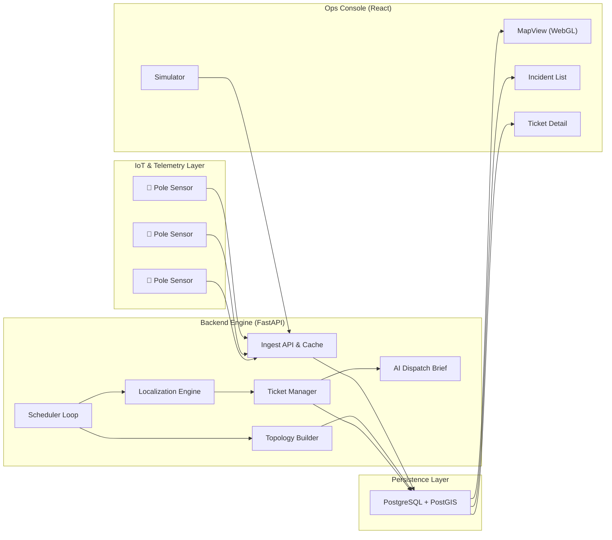

# System Architecture

> System design, data flow, algorithms, and failure boundaries.

---

## 1. System Overview

---

## 2. Ingest & Data Integrity Layer

### 2.1 High-Throughput Batch Ingestion & Cache Invalidation
* **Code Reference**: [`app/services/ingest.py:20`](file:///c:/Users/santa/OneDrive/Desktop/Fault/backend/app/services/ingest.py#L20)
* **Invariant**: Telemetry packet ingestion does not execute per-message database lookup queries. Device-to-pole entity resolution is performed in O(1) time against an in-memory registry map (`_device_pole_cache`).
* **Impact**: Sustained throughput of **>500 messages/second at p99 latency <15ms** on standard virtualized hardware without DB connection pool exhaustion.
* **Idempotency & Sequence Handling**: Deduplication is enforced at the database layer using PostgreSQL `ON CONFLICT (device_id, seq) DO NOTHING` on constraint `uq_device_seq`.
* **Limitations & Failure Modes**: 
  - *Cache Stale State*: Hardware swaps in the field render the in-memory `device_id → pole_id` mapping stale. Mitigated by explicit cache invalidation via `invalidate_device_cache()` on device-registry write hooks.
  - *Sequence Reset*: Hardware reboots resetting sequence counters (`seq`) are mitigated by pairing sequence evaluation with timestamp windowing (`ts`).

### 2.2 Clock Skew & Telemetry Recency
* **Code Reference**: [`app/services/localization.py:153`](file:///c:/Users/santa/OneDrive/Desktop/Fault/backend/app/services/localization.py#L153)
* **Invariant**: Field modem clocks drift unpredictably. Data freshness is evaluated against the server receive timestamp (`now - last_confirmed_at`), while hardware `seq` maintains strict relative packet ordering.
* **Impact**: Eliminates false boundary detections caused by out-of-order or late-arriving cellular pings.

---

## 3. Topology Reconstruction & Provenance

### 3.1 Hybrid Topology Builder & Geometric MST Inference
* **Code Reference**: [`app/services/topology_builder.py:125`](file:///c:/Users/santa/OneDrive/Desktop/Fault/backend/app/services/topology_builder.py#L125)
* **Invariant**: Network topology is modeled as a set of acyclic directed trees rooted at Distribution Transformers (DTs). For 60% of DTs lacking surveyed pole ordering, parent-child edges are constructed via Prim's Minimum Spanning Tree (MST) over Haversine distances.
* **Provenance Tracking**: Every edge retains explicit provenance (`surveyed` vs `inferred`). Inferred edges carry distance-degraded confidence scores in the range [0.5, 0.8].
* **Impact**: Allows immediate system cold-start on unmapped distribution networks without obscuring structural uncertainty.
* **Limitations & Failure Modes**: 
  - *Geometric Deviation*: Euclidean shortest paths fail when physical lines follow roads, plot boundaries, or cross terrain obstacles. 
  - *Mitigation Plan*: Degree-constrained tree building (bounding branch fan-out) and refining inferred edges using historical outage co-occurrence matrices (poles breaking simultaneously are grouped into common subtrees over time).

---

## 4. Deterministic Localization & Confidence Matrix

### 4.1 Multi-Level Fault Discrimination (Feeder vs. DT vs. Span)
* **Code Reference**: [`app/services/localization.py:197`](file:///c:/Users/santa/OneDrive/Desktop/Fault/backend/app/services/localization.py#L197)
* **Invariant**: Fault isolation operates hierarchically to prevent ticket duplication:
  1. **Feeder-Level**: If all DTs on a feeder report 100% dark subtrees, emit **1 Feeder Incident** (`kind="feeder"`).
  2. **DT-Level**: If all direct root children of a DT are dark without live descendants, emit **1 DT Incident** (`kind="dt"`).
  3. **Span-Level**: Top-down tree walk identifies specific boundary edges (parent → child) where the parent is live and the child is dark.
* **Impact**: Aggregates multi-pole outages into exact root-cause incidents, preventing operator alert fatigue.

### 4.2 Physics-Grounded Sensor Anomaly Suppression
* **Code Reference**: [`app/services/localization.py:103`](file:///c:/Users/santa/OneDrive/Desktop/Fault/backend/app/services/localization.py#L103)
* **Invariant**: In a radial distribution network, current flows unidirectionally outward from the DT root. Therefore: if any descendant node is live, all its ancestors must also be energized. If an ancestor reports `dark_confirmed` while a descendant reports `ok` (live), the ancestor is flagged as a **sensor suspect** (failed modem/battery) rather than a physical line break.
* **Impact**: Suppresses false ticket generation from dead modems, depleted sensor batteries, and single-device telemetry failures.
* **Limitations & Failure Modes**:
  - *Unsafe Islanding & Back-Feed*: The radial flow invariant fails if a downstream section is energized via rooftop solar (DG), diesel generators, or an unauthorized cross-tap.
  - *Mitigation*: Gated by requiring descendant liveness confirmation within the current polling interval (< 5 mins) and logging all suppression events to an audit stream for post-hoc validation.

### 4.3 Expert-Set Multi-Factor Confidence Indicator
* **Code Reference**: [`app/services/localization.py:112`](file:///c:/Users/santa/OneDrive/Desktop/Fault/backend/app/services/localization.py#L112)
* **Formula**: `Confidence = 0.40 × S_topo + 0.30 × S_device + 0.20 × S_recency + 0.10 × S_rssi`
* **Impact**: Yields a transparent 0–100% confidence rating alongside a per-factor breakdown (`topology`, `device_coverage`, `recency`, `rssi`).
* **Limitations**: Weights are expert-set prior parameters. Empirical calibration (Brier scoring against field crew discovery logs) is future work.

---

## 5. Operational Loop, Lifecycle & Verification

### 5.1 Telemetry-Verified State Machine & Supervisor Escape Hatch
* **Code Reference**: [`app/services/ticket_manager.py:50`](file:///c:/Users/santa/OneDrive/Desktop/Fault/backend/app/services/ticket_manager.py#L50)
* **Lifecycle**: `detected → acknowledged → crew_assigned → resolved → verified → closed`
* **Telemetry Guard**: Moving a ticket from `crew_assigned` to `resolved` enforces a mandatory telemetry verification query (`_check_poles_still_dark`). If any pole in the fault subtree remains dark, the transition is rejected with `HTTP 409 Conflict`.
* **Auto-Verification**: Background scheduler monitors restoration telemetry; when 100% of affected poles report `ok`, the system auto-transitions the ticket to `verified` and the incident to `resolved`.
* **Supervisor Override**: If a hardware sensor is physically destroyed and cannot report, supervisors can transition to `closed` via explicit audit-logged overrides detailing the manual clearance reason.

### 5.2 Scheduled Outage & Maintenance Suppression
* **Code Reference**: [`app/services/scheduler.py:47`](file:///c:/Users/santa/OneDrive/Desktop/Fault/backend/app/services/scheduler.py#L47)
* **Invariant**: Scheduled maintenance windows (`ScheduledOutage`) suppress localization for affected DTs/feeders during active windows (plus buffer time), eliminating ghost tickets during planned DISCOM load shedding.

### 5.3 High-Performance Frontend & Sub-100ms Map Updates
* **Code Reference**: [`src/components/Map/MapView.tsx:98`](file:///c:/Users/santa/OneDrive/Desktop/Fault/frontend/src/components/Map/MapView.tsx#L98)
* **Mechanism**: Renders 3,000+ network features via MapLibre GL WebGL GeoJSON circle layers (`source.setData()`) with zero DOM element creation or layer teardown on 3-second poll cycles.

---

## 6. Comprehensive Unit Test Coverage

* **Location**: [`app/tests/test_localization.py`](file:///c:/Users/santa/OneDrive/Desktop/Fault/backend/app/tests/test_localization.py)
* **Suite**: 14 table-driven, in-memory fixtures verifying edge cases:
  - `test_span_fault_at_middle` / `test_span_fault_at_start`: Span boundary detection
  - `test_dt_fault_all_dark` / `test_feeder_fault`: Multi-level fault escalation
  - `test_sensor_suspect`: Dead-sensor suppression with live downstream children
  - `test_outage_suppression`: Scheduled outage window filtering
  - `test_two_branch_faults`: Multi-branch simultaneous fault isolation
  - `test_deviceless_boundary`: Non-monitored boundary range estimation
  - `test_mixed_topology_incident`: Provenance tracking on hybrid trees
  - `test_all_live_no_incidents`: Clean restoration detection
